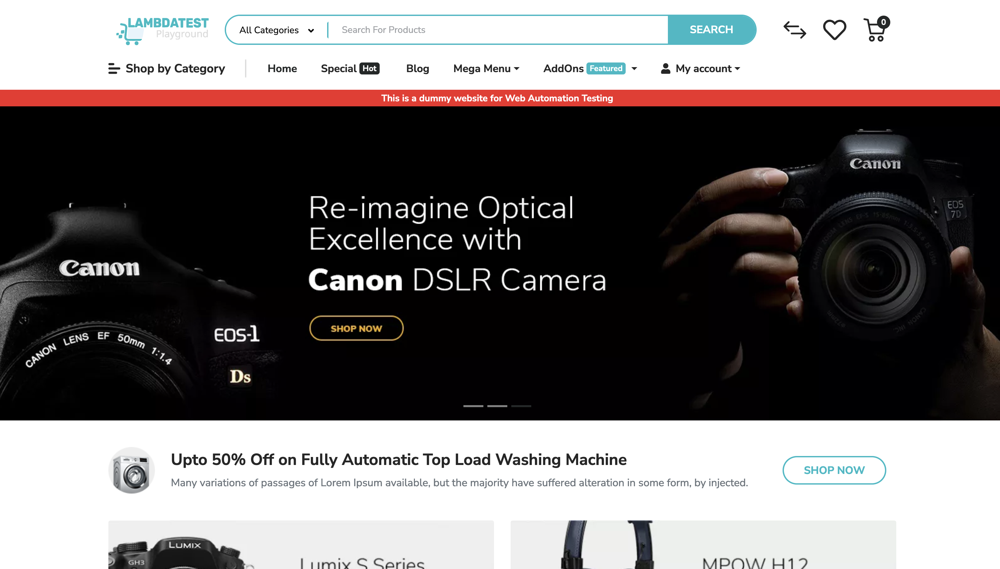
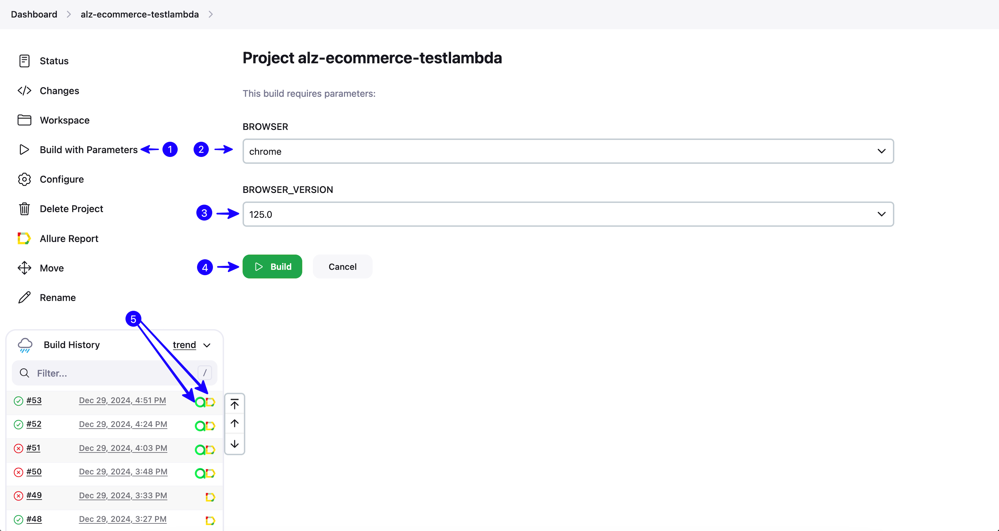
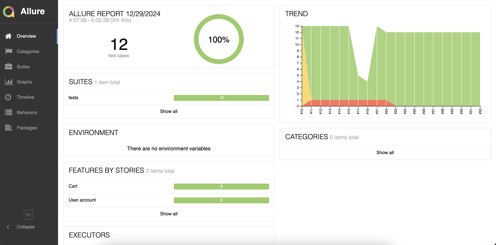
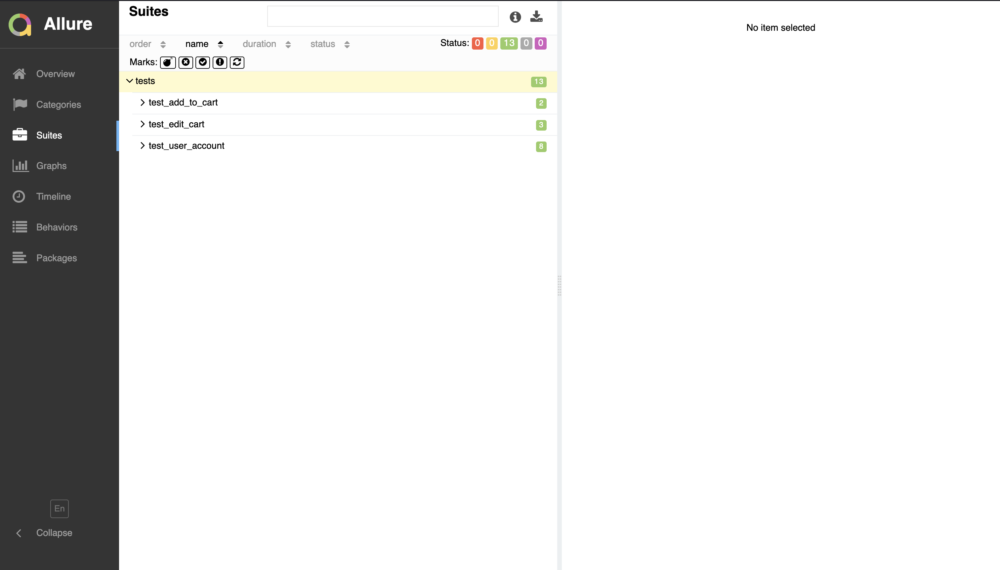
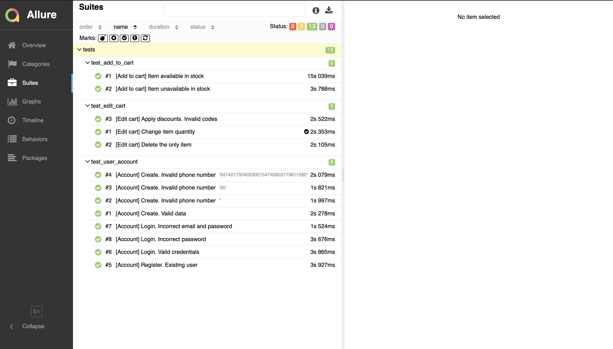
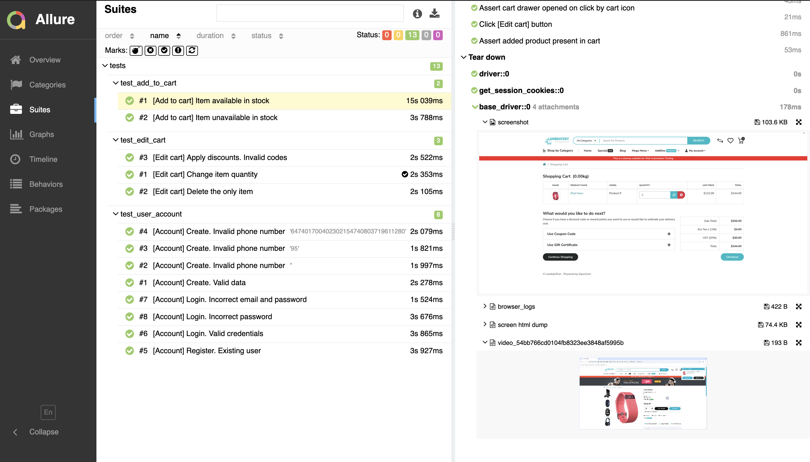
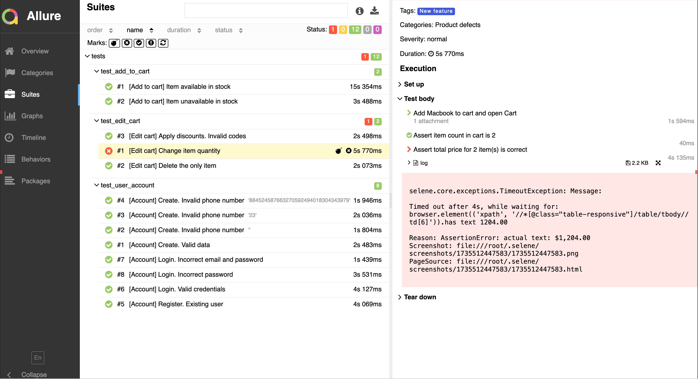
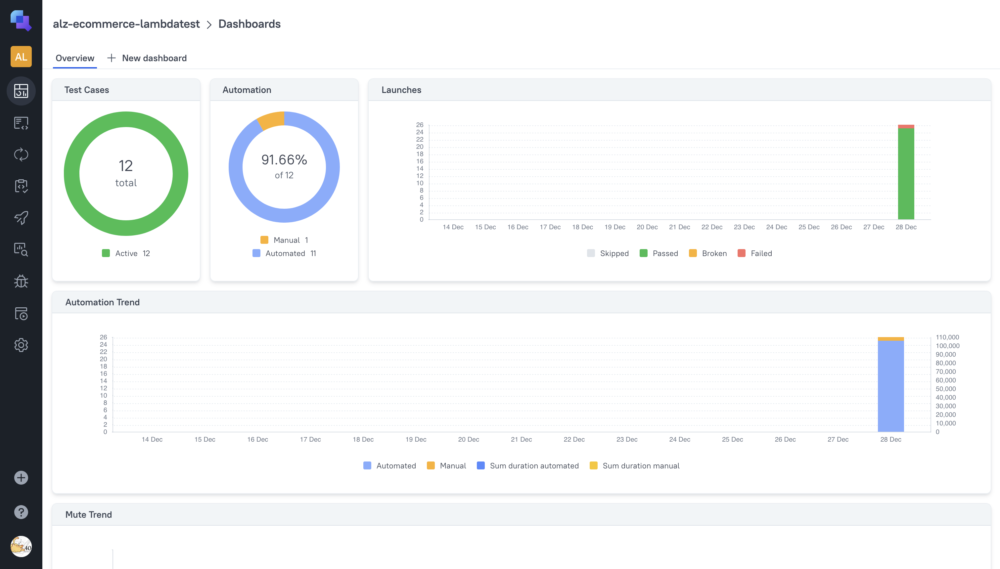
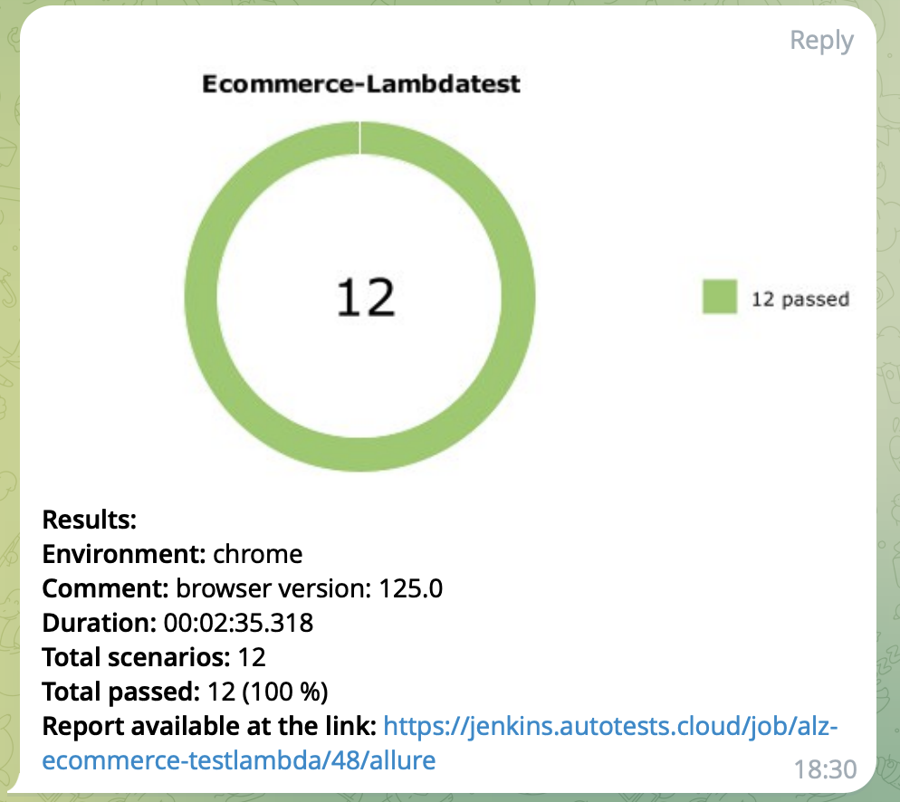
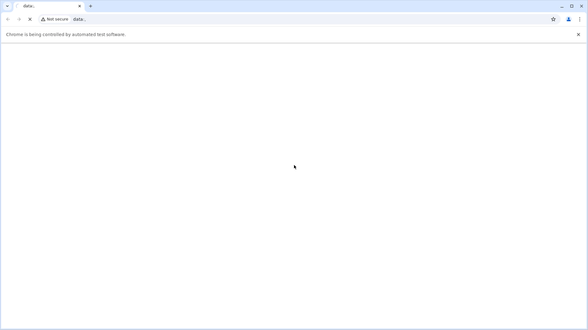

# <p align="center"> UI automation project <a href="https://ecommerce-playground.lambdatest.io"> Ecommerce Lambdatest </a></p>
<p align="center">
    
</p>

## Contents

> ➠ [Technology Stack](#technology-stack)
>
> ➠ [Covered Functionality](#covered-functionality)
>
> ➠ [Run Tests in Jenkins](#run-tests-in-jenkins)
>
> ➠ [Allure Report](#allure-report)
>
> ➠ [Allure TestOps](#allure-testops-integration)
>
> ➠ [Messenger Notifications](#messenger-notifications)
>
> ➠ [Test Run Record Example](#test-run-record-example)

## Technology Stack
<p  align="center">
    <code></code>
    <code></code>
    <code></code>
    <code></code>
    <code></code>
    <code></code>
    <code></code>
    <code></code>
    <code></code>
    <code></code>
</p>

## Covered Functionality 
#### UI tests were designed to check the following scenarios:

* ✅ Register new user with valid data
* ✅ Successful login
* ✅ Register new user with invalid phone numbers
* ✅ Register existing user
* ✅ Login with invalid email and password
* ✅ Login with invalid password


* ✅ Available product can be added to the cart
* ✅ Unavailable product can not be added to the cart
* ✅ User can change item quantity in the cart
* ✅ User can delete item position from the cart
* ✅ User can not apply invalid discount codes


## Run tests in Jenkins
[Link to Jenkins job](https://jenkins.autotests.cloud/job/alz-ecommerce-testlambda/) 

Project test framework provides an easy and convenient build setup.  
To run tests:
1. Click on `Build with Parametes`
2. Choose browser from dropdown menu
3. Choose browser version from dropdown menu
4. Click on `Build`
5. After build is finished, links to Allure Report and Allure TestOps will be shown next to the job
<p align="center">

</p> 

## Run tests locally

Local run requires [Python](https://www.python.org/downloads/release/python-3126/)
and [Poetry](https://python-poetry.org/docs/#installation) installed.

1. Download the project and `cd` to its directory
2. In project root create virtual environment and install dependencies

```bash
python3 -m venv .venv
source .venv/bin/activate
poetry install --no-root
```

3. In project root create `.env` file and put `browser_name` into it as it is shown in `.env_example`.
Possible options: 'chrome', 'firefox'

```nano
browser_name = 'chrome'
```

4. Run tests

```bash
pytest --local-run
```

When run is finished `app.log` file and `allure-results` directory will be generated in project root. If Allure Report is [installed](https://allurereport.org/docs/install/), a report can be generated
```bash
allure serve allure-results
```

## Allure Report
Clicking on the Allure Report link we get a full overview of finished run.
It includes:
- Summary
<p align="center">
    
</p> 

- Information about test suits and tests within it
<p align="center">
    
</p>
<p align="center">
    
</p>

- Detailed steps and attachments to each test (logs, API responses, screenshots and videos)
<p align="center">
    
</p>  

- In case of test failure, it can be fast identified where the problem is
<p align="center">
    
</p> 

## Allure TestOps Integration
###  [Dashboard](https://allure.autotests.cloud/project/4542/dashboards)
<p align="center">
    
</p>

Allure TestOps is integrated with Jenkins, and test results are shown in the dashboard. Automated tests can also be run from Allure TestOps directly. 

---

## Messenger Notifications
After Jenkins build is finished, a report with the results is sent to a messenger.
<p align="center">
    
</p>

## Test Run Record Example
<p align="center">
    
</p>